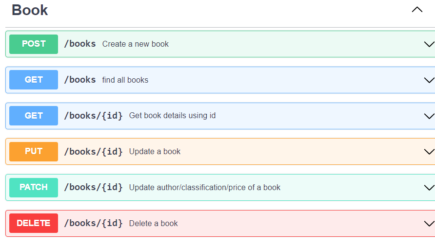
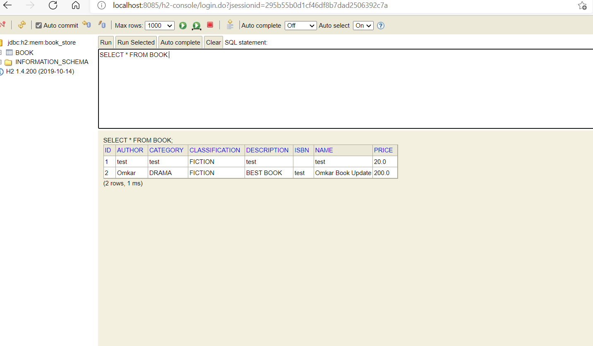
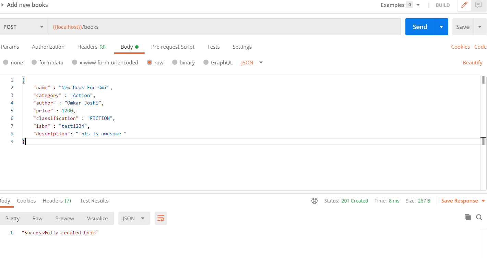
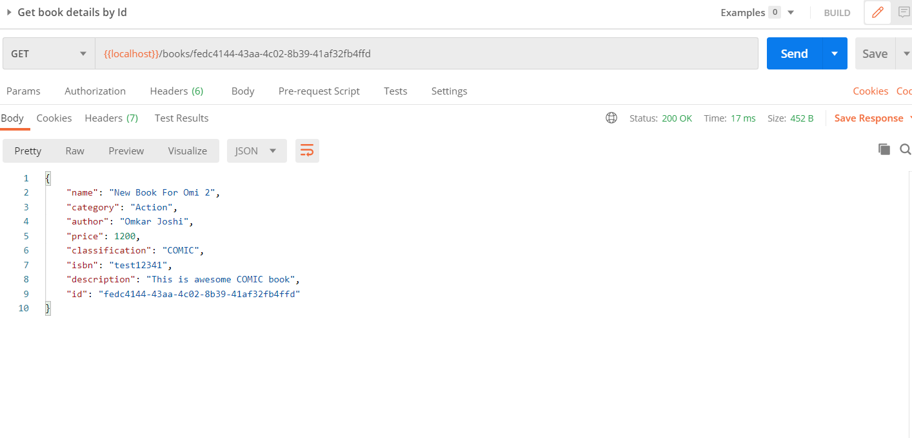
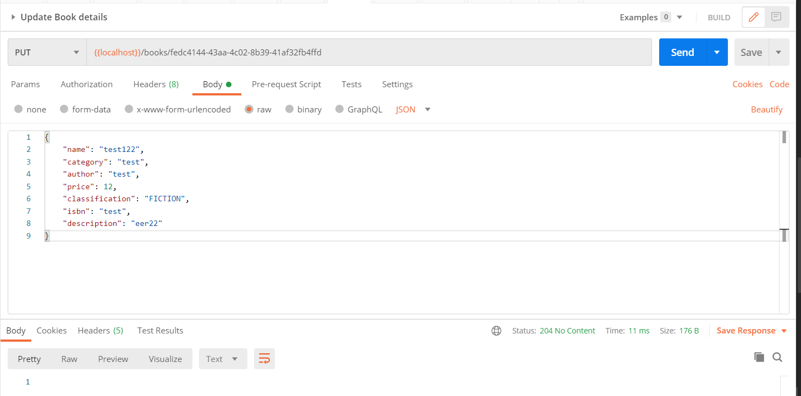
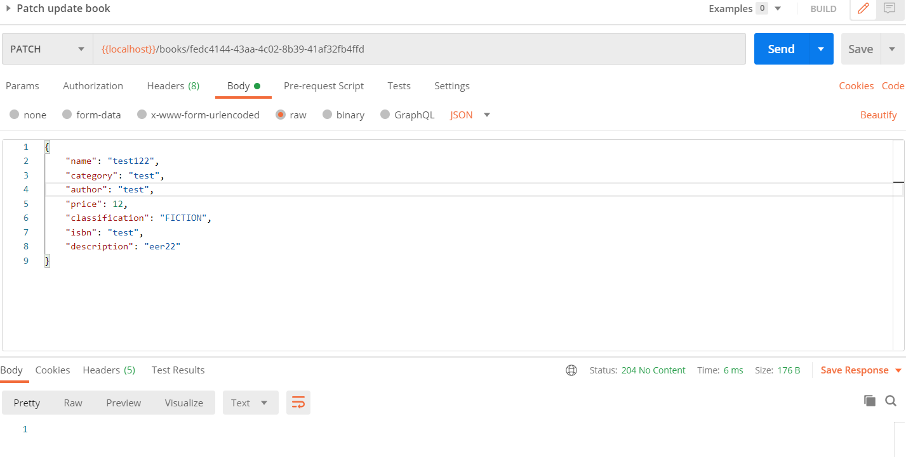

# Books REST API with SPRINGBOOT

## Introduction
This is a code for Book Store Assessment API, Integrated with H2 database

## Software Requirements

-  Java 8 or 9
-  Maven 3.2+

### Using Git (recommended)

Clone the project from github [https://github.com/omijoshi09/book_store_rest_springboot.git]

### Check Database

1) http://localhost:8085/h2-console
2) Set JDBC URL to: jdbc:h2:mem:book_store
3) Spring.datasource.username=omi   
4) Click Connect

## Sample Output

### Create New Book

### Get All Books

### Get Book By {id}

### Update Book Details By {id}

### Patch Book Details By {id}

### Delete Book By {id}

